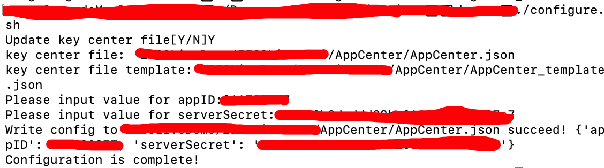
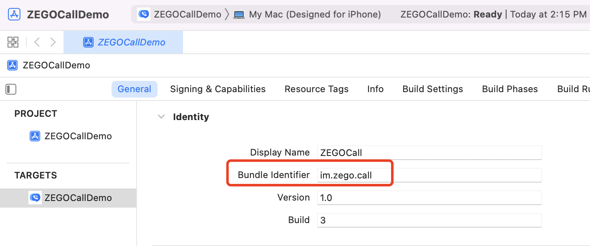
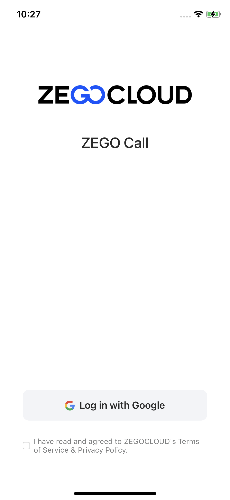

# ZEGO Call

ZEGOCLOUD's Voice Call and Video Call let you build high-quality voice and video calls into apps that fit various needs of different scenarios, including social interactions, work collaboration, customer services, and more.

## Getting started

Before getting started with the ZEGOCLOUD Call application, **contact us to activate the Voice and Video Call (RTC + IM) service first**, and then do the following:

### Prerequisites

* [Xcode 12 or later](https://developer.apple.com/xcode/download)
* [CocoaPods](https://guides.cocoapods.org/using/getting-started.html#installation)
* An iOS device or Simulator that is running on iOS 13.0 or later and supports audio and video. We recommend you use a real device.
* Create a project in [ZEGOCLOUD Admin Console](https://console.zegocloud.com/). For details, see [ZEGO Admin Console - Project management](https://docs.zegocloud.com/article/1271).

###  Install Pods

1. Clone the Live Room Github repository. 
2. Open Terminal, navigate to the `ZEGOCallDemo` folder where the `Podfile` is located, and run the `pod repo update` command.
3. Run the `pod install` command to install all dependencies that are needed.

### Modify the project configurations

1. For macOs, open Terminal, navigate to the `call_ios` folder where the `configure.sh` is located. 

2. Run the configuration script with the `./configure.sh` command. And fill in the AppID, AppSign, and ServerSecret, which can be obtained in the [ZEGO Admin Console](https://console.zegocloud.com/). 
**Note**: If you are using Windows system, double-click the `configure.bat` to run the configuration script. 
      

3. Open the `ZEGOCallDemo.xcworkspace` in Xcode.

4. In the **General** tab of the `ZEGOCallDemo` project, change the `Bundle Identifier` configuration.

      

5. Click the **Signing & Capabilities** tab and select your own developer account in the **Team**.  

      


### Run the sample code

1. Connect the iOS device to your computer.

2. Open Xcode, click the **Any iOS Device** in the upper left corner, select the iOS device you are using.

3. Click the **Build** button in the upper left corner to run the sample code and experience the call service.

      


## Project structure

The project consists of two modules: **ZEGOCall** and **ZEGOCallDemo**.

### ZEGOCall

The ZEGOCall module improves reusability and further encapsulates the RTC and IM for you to integrate easier. The following shows the structure:

Directory path: 

```
{your_project_root_path}/call_ios/ZEGOCallDemo/ZEGOCall
```

```
.
├── Command																		  	  ---  Firebase requests function encapsulation
├── Core
│   ├── Commands 																    --- Firebase relate command, such as Login in/out of Firebase, getting user lists, and call related.
│   ├── Define.swift															  --- Common definitions and error codes of ZEGOCall.
│   ├── Interface
│   │   ├── CallService.swift												--- Call related interface, such as start/end call, accept call and more
│   │   ├── DeviceService.swift										  --- Device related service, such as turn on/off the  microphone/camera, and more.
│   │   ├── RoomService.swift												--- Room related service, such as join/leave a room, update room information, and more.
│   │   ├── StreamService.swift											--- Stream related service, such as play/stop stream.
│   │   └── UserService.swift												---  User related service, such as login/loginOut, get user list and more.
│   ├── InterfaceIMP															  --- The implementation logic of the interface
│   ├── Manager																		
│   │   └── ServiceManager.swift										--- Room related instances that used to initialize the SDK, and provide the capabilities for service implementation.
│   └── Model																			  --- Models, such as UserInfo, RoomInfo, and CallInfo.
├── Listener
│   ├── Listener.swift
│   ├── ListenerManager.swift
│   └── ListenerUpdater.swift
├── Reqeust																				  --- Firebase related request
├── Tool
```

### ZEGOCallUIKit

The ZEGOCallUIKit module is a layer of ZEGOCall packaging, simplified interactive video scene access, internal complete call logic and call UI.

Directory path: 

```
{your_project_root_path}/call_ios/ZEGOCallDemo/ZEGOCallUIKit
```

```
.
├── CallInterface																					--- AppleCallKit interface
│   └── AppleCallKitService.swift			
├── CallInterfaceIMP
│   └── AppleCallKitServiceIMP.swift											--- AppleCallKit implementation
├── CallManager										
│   ├── CallManager+AcceptTipAction.swift									--- Call notice event handing
│   ├── CallManager+CallKit.swift													--- CallKit relate logic
│   ├── CallManager+CallService.swift											--- Call service related logic
│   ├── CallManager+CallTime.swift												--- Call time manager callback handing
│   ├── CallManager+DeviceService.swift										--- Device service callback handing 
│   ├── CallManager+Minimized.swift												--- Minimize event handling
│   ├── CallManager+UserService.swift											--- User service related logic
│   ├── CallManager.swift                        					--- Call logic manager
│   ├── CallManagerInterface.swift												--- CallUIKit Public API
│   ├── CallTimeManager.swift															--- Call time manager
│   └── MinimizedDisplayManager.swift											--- Call minimization logic manager
├── CallUI																								--- The UI related
│   ├── Model   																					--- Models, such as CallSettingModel and CallSettingSecondLevelModel
│   ├── Provider					
│   │   └── ProviderDelegate.swift												--- Apple CallKit relate logic and Callback
│   ├── VC																								--- Call ViewController
│   └── View																							--- Call related View
├── CallUIKit.xcassets																		--- Images, colors, and more resources
├── CallUIKitDefine.swift			 														--- Common definitions of ZEGOCallUIKit.
├── Helper																								--- Utilities

```


### ZEGOCallDemo

The ZEGOCallDemo module implements the business and UI interaction logic, including login, contact list, calling, and more. The following shows the structure:

Directory path: 

```
{your_project_root_path}/call_ios/ZEGOCallDemo/ZEGOCallDemo
```

```
.
├── AppCenter            --- AppID, AppSign, ServerSecret and more
├── Assets.xcassets      --- Images, colors, and more resources
├── CorePages            --- UI and business logic of core features 
│   ├── Home             --- Homepage
│   ├── Login            --- Login
│   ├── Setting          --- The Settings page
│   ├── User             --- The online contacts page
│   └── WebPages         --- The Web page
├── Tool
│   ├── CustomButton.swift					--- The custom button
│   ├── DeviceTool.swift						--- The device permissions relate
│   ├── LoginManager.swift					--- The login relate
│   ├── TokenManager.swift					--- The token relate
│   └── UserListManager.swift				--- The user list relate
```

 

## More documentation

You can find more documentation on our official website: [Voice and Video Call](https://docs.zegocloud.com/article/13840).


